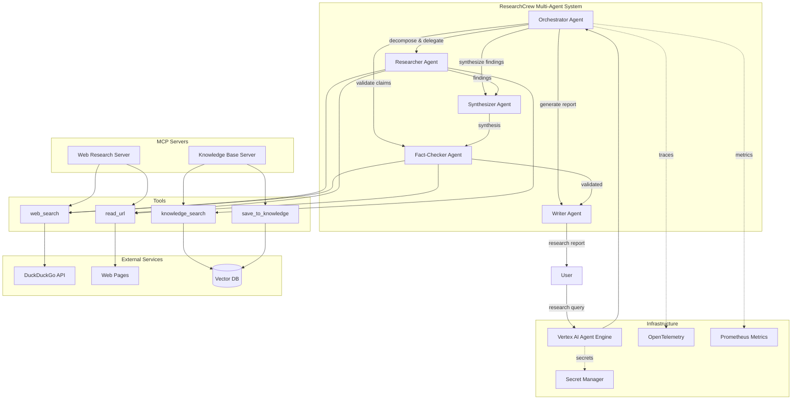

# ResearchCrew System Architecture

This document describes the architecture of the ResearchCrew multi-agent research assistant.

## Overview

ResearchCrew is a hierarchical multi-agent system built on Google ADK (Agent Development Kit). It uses specialized agents to conduct comprehensive research, with an orchestrator coordinating the workflow.

## Architecture Diagram



## Component Overview

### Agents

| Agent | Responsibility | Tools |
|-------|----------------|-------|
| **Orchestrator** | Workflow coordination, task decomposition | delegate_task, get_status |
| **Researcher** | Information gathering from web and knowledge base | web_search, read_url, knowledge_search |
| **Synthesizer** | Combining findings into coherent insights | None (LLM-only) |
| **Fact-Checker** | Validating claims against sources | web_search, read_url |
| **Writer** | Generating final research reports | None (LLM-only) |

### Tools

| Tool | Description | Used By |
|------|-------------|---------|
| `web_search` | Search the web using DuckDuckGo | Researcher, Fact-Checker |
| `read_url` | Extract content from web pages | Researcher, Fact-Checker |
| `knowledge_search` | Query the vector knowledge base | Researcher |
| `save_to_knowledge` | Store findings in knowledge base | Researcher |

### Infrastructure

| Component | Purpose |
|-----------|---------|
| **Vertex AI Agent Engine** | Production deployment platform |
| **OpenTelemetry** | Distributed tracing |
| **Prometheus** | Metrics collection |
| **Secret Manager** | Secure API key storage |

## Data Flow

### Research Workflow

```
1. User submits research query
        ↓
2. Orchestrator decomposes query into 3-5 sub-questions
        ↓
3. Researchers gather information (parallel)
   - Execute web searches
   - Extract content from URLs
   - Query knowledge base
        ↓
4. Synthesizer combines findings
   - Identify themes
   - Resolve conflicts
   - Rank by confidence
        ↓
5. Fact-Checker validates claims
   - Cross-reference sources
   - Flag unsupported statements
        ↓
6. Writer generates report
   - Format as markdown
   - Include citations
   - Add confidence scores
        ↓
7. Return report to user
```

### Session Management

Sessions enable multi-turn conversations where follow-up queries reference previous research.

```
Session State:
├── session_id
├── user_id
├── conversation_history[]
│   ├── turn_id
│   ├── query
│   ├── summary
│   └── findings_count
├── context
│   ├── topics[]
│   ├── key_facts[]
│   └── sources[]
└── timestamps
```

Context management ensures sessions don't exceed model token limits:
- Automatic compression when approaching limits
- Summarization of older turns
- Priority retention of key facts

## Quality Architecture

### Quality Gates

```
Research Output
      ↓
┌─────────────────┐
│ Source Quality  │  ≥ 80%
│ Check           │
└────────┬────────┘
         ↓
┌─────────────────┐
│ Factual         │  ≥ 85%
│ Accuracy Check  │
└────────┬────────┘
         ↓
┌─────────────────┐
│ Completeness    │  ≥ 75%
│ Check           │
└────────┬────────┘
         ↓
┌─────────────────┐
│ Coherence       │  ≥ 80%
│ Check           │
└────────┬────────┘
         ↓
    Final Report
```

### Evaluation Pipeline

The evaluation system uses DeepEval for automated quality assessment:

1. **Golden Dataset**: 20+ test cases covering various research scenarios
2. **Metrics**: Factual accuracy, source quality, completeness, coherence
3. **Baseline Report**: Established benchmarks for regression detection
4. **CI Integration**: Quality gates in GitHub Actions

## Resilience Architecture

### Circuit Breaker Pattern

```
CLOSED ──(failures ≥ threshold)──→ OPEN
   ↑                                  │
   │                                  │
   └──(success_threshold met)── HALF_OPEN ←──(timeout)──
                                      │
                                      └──(failure)──→ OPEN
```

Circuit breakers protect external service calls:
- **Failure Threshold**: 5 failures within 60 seconds
- **Recovery Timeout**: 30 seconds before attempting recovery
- **Half-Open Limit**: 3 test calls allowed

### Retry Policy

```python
RetryConfig(
    max_attempts=3,
    min_wait=1.0,      # seconds
    max_wait=60.0,     # seconds
    exponential_base=2,
    jitter=True,
)
```

Error classification determines retry behavior:
- **Transient**: Retry with backoff (network errors, rate limits)
- **Permanent**: Fail immediately (auth errors, invalid input)
- **Rate Limit**: Extended backoff with reset time

## Deployment Architecture

### Container Architecture

```
┌─────────────────────────────────────┐
│           Docker Container          │
├─────────────────────────────────────┤
│  Python 3.12 Runtime                │
│  ├── google-adk                     │
│  ├── opentelemetry                  │
│  └── researchcrew code              │
├─────────────────────────────────────┤
│  Non-root user (appuser)            │
│  Health check: /health              │
│  Port: 8080                         │
└─────────────────────────────────────┘
```

### Scaling Configuration

| Setting | Value | Description |
|---------|-------|-------------|
| Min Instances | 0 | Scale to zero when idle |
| Max Instances | 5 | Maximum concurrent instances |
| Max Concurrent | 80 | Requests per instance |
| Target CPU | 70% | Auto-scaling trigger |

### Environment Configurations

| Environment | Purpose | Observability |
|-------------|---------|---------------|
| **Development** | Local testing | Console logging |
| **Staging** | Pre-production validation | Cloud Trace + Monitoring |
| **Production** | Live system | Full observability stack |

## Observability Architecture

### Tracing

Spans are created for all significant operations:

```
research_workflow
├── session.resolve
├── context.build
├── agent.orchestrator
│   ├── task.decompose
│   └── task.delegate
├── agent.researcher (parallel)
│   ├── tool.web_search
│   └── tool.read_url
├── agent.synthesizer
├── agent.fact_checker
│   └── tool.web_search
└── agent.writer
```

### Metrics

| Metric | Type | Labels |
|--------|------|--------|
| `request_duration_seconds` | Histogram | agent |
| `token_usage_total` | Counter | agent, type |
| `tool_calls_total` | Counter | tool, status |
| `errors_total` | Counter | agent, error_type |
| `circuit_state` | Gauge | circuit_name |

## Security Architecture

### Secrets Management

- API keys stored in Google Secret Manager
- No secrets in code or configuration files
- Runtime injection via environment variables

### Network Security

- Non-root container execution
- VPC connector for private networking
- Configurable ingress/egress policies

### Access Control

- Service account with minimal permissions
- Workload Identity for GKE deployments
- Audit logging enabled

## Integration Points

### MCP Servers

Model Context Protocol servers enable tool reuse:

| Server | Tools | Transport |
|--------|-------|-----------|
| Web Research | web_search, read_url | stdio |
| Knowledge Base | knowledge_search, save_to_knowledge | stdio |

### LangGraph Adapter

Bidirectional integration with LangGraph workflows:
- **Pattern A**: Use LangGraph graphs as ADK tools
- **Pattern B**: Use ADK agents as LangGraph nodes

## Related Documentation

- [AGENTS.md](../AGENTS.md) - Detailed agent specifications
- [API Documentation](./api.md) - API reference
- [Deployment Guide](./deployment.md) - Deployment instructions
- [Debugging Runbook](./debugging-runbook.md) - Troubleshooting guide
- [MCP Servers](./mcp-servers.md) - MCP server documentation
- [Integrations](./integrations.md) - External framework integration
